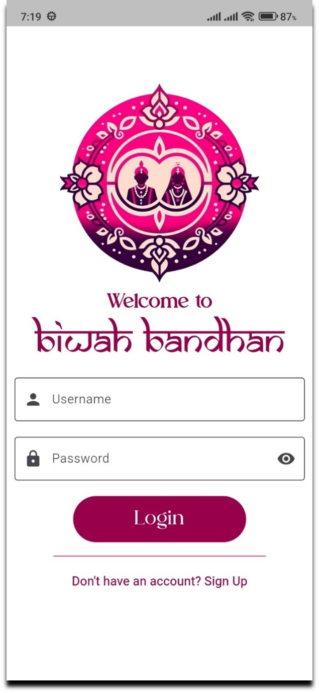
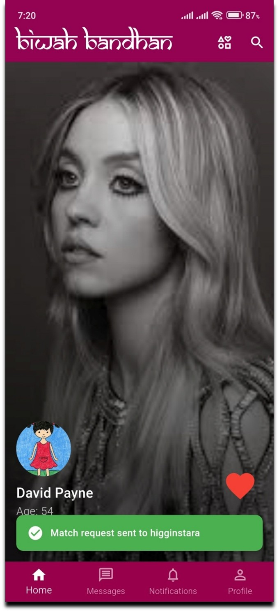
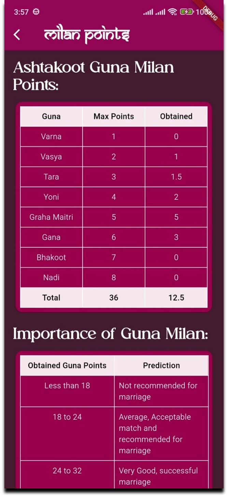
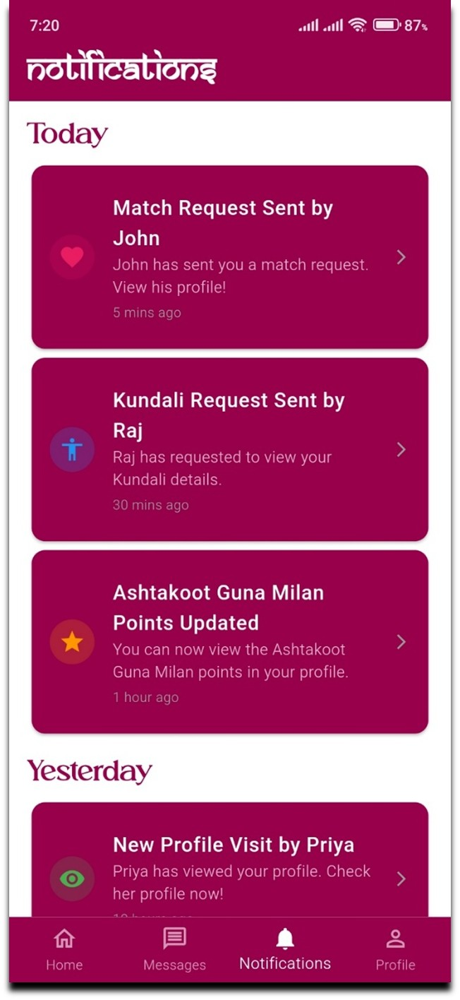
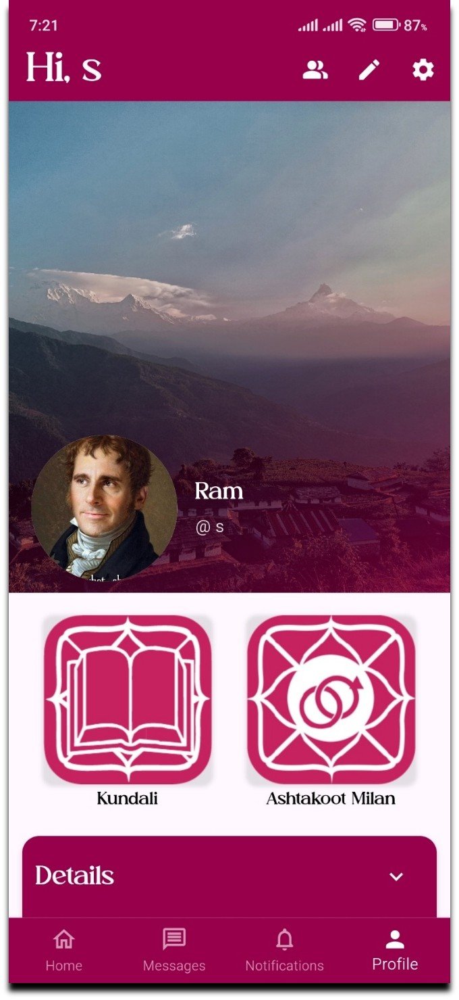
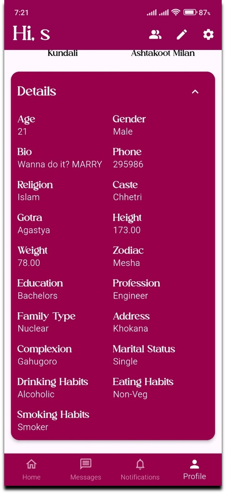
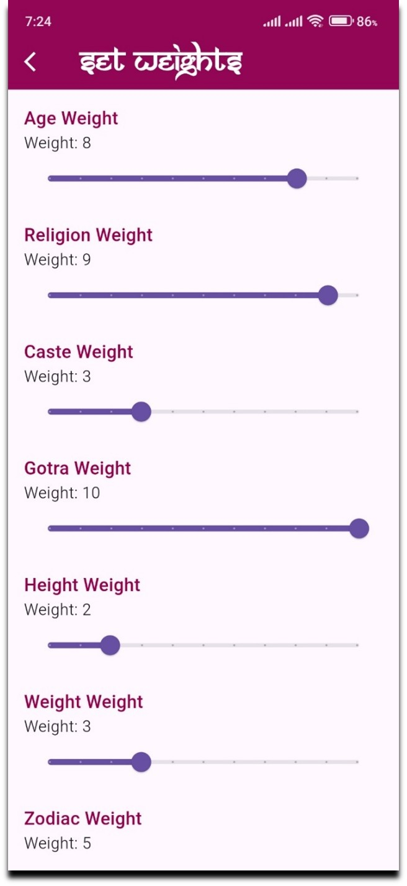
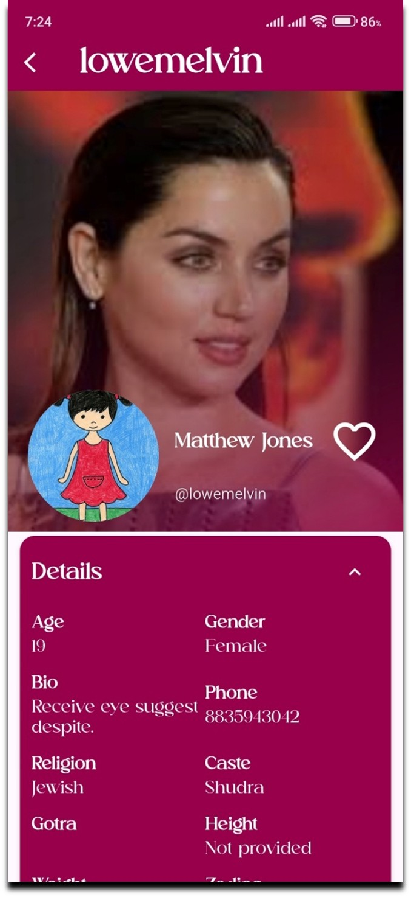
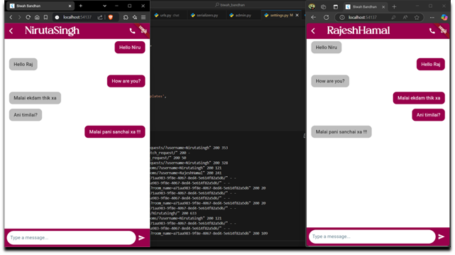

# 🕊️ Biwah Bandhan – Matrimonial App (Frontend)

**Biwah Bandhan** is a modern Flutter-based matrimonial application designed to help individuals find compatible life partners through a personalized and user-friendly experience. This repository contains the complete frontend codebase for the Biwah Bandhan mobile application.

## 🚀 Overview

The Biwah Bandhan app provides a seamless and intuitive interface to explore user profiles, send match requests, and communicate with potential partners. Key features include:

- 🔍 Advanced profile search and filters (age, religion, caste, etc.)
- 📱 TikTok-style infinite profile feed
- 💬 In-app chat and calling functionality (under development)
- 🔐 Secure user authentication
- 🧾 Kundali generation and compatibility matching
- ✏️ Editable user profiles and preferences

This frontend is built using **Flutter**, and it connects to a **Django** backend and **PostgreSQL** database.

## 🛠️ Technologies Used

- Flutter (Dart)
- Django (Backend)
- PostgreSQL (Database)
- REST API
- flutter_svg for SVG rendering

## 📸 Screenshots

<table>
  <tr>
    <td></td>
    <td></td>
  </tr>
  <tr>
    <td></td>
    <td></td>
  </tr>
  <tr>
    <td></td>
    <td></td>
  </tr>
  <tr>
    <td></td>
    <td></td>
  </tr>
  <tr>
    <td></td>
    <td></td>
  </tr>
  <tr>
    <td></td>
  </tr>
</table>

